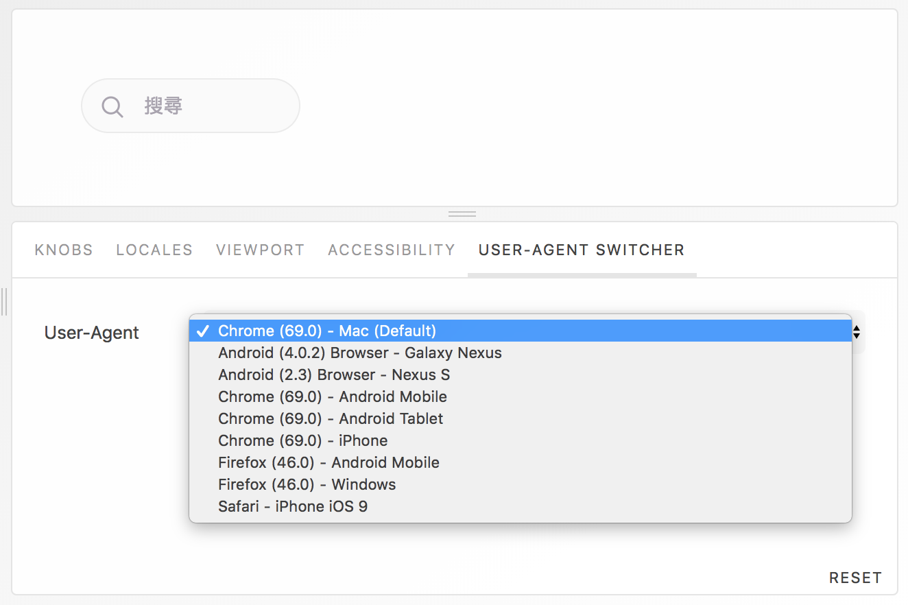

# storybook-addon-user-agent
This addon for storybook will allow you to view your component rendering with different user-agent.



## Getting Started
First, install the addon
```
yarn add -D storybook-addon-user-agent
```

Register the addon
```js
// addons.js
import 'storybook-addon-user-agent/dist/register';
```

Done!

## Work with **bowser**
Sometimes we use [**bowser**](https://github.com/lancedikson/bowser) in our project for browser detection which depends on user-agent identification. Since we want **bowser** re-parse current user-agent right after we select new user-agent (which might not be workable in current major version v1.x of bowser, and looks like it will come with v2. I'm not sure for it, please update me if I'm missing something here 🙏).  
In this case, you can use the bowser module we provided here. In fact, it just a module extended the origin **bowser** with detecting whether you are working in `storybook` or not, if so, it'll parse **user-agent** every execution, if not, then it will just work as usual.
```js
// change
import bowser from 'bowser';
// to
import bowser from 'storybook-addon-user-agent/bowser';

// usage is same as usual
// bowser.mobile, ...
```
